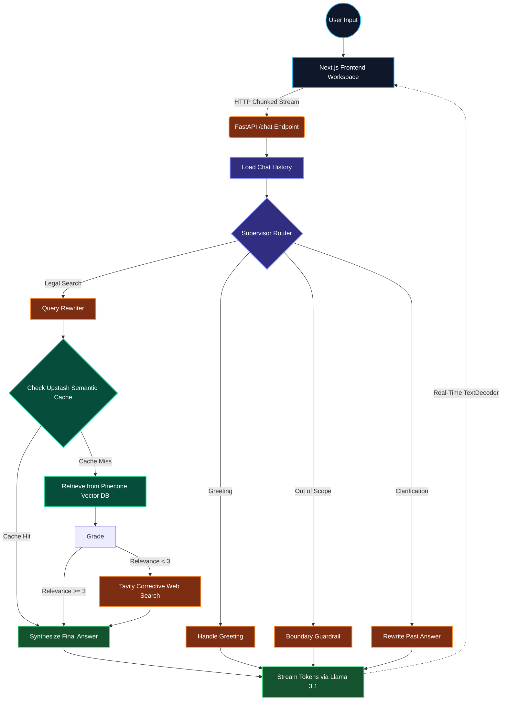

# LegalBuddy — Enterprise AI-Powered Legal Assistant

> Conversational legal guidance for India, powered by Corrective RAG (CRAG), LangGraph, and Llama 3.1.

[](https://nextjs.org/)
[](https://fastapi.tiangolo.com/)
[](https://langchain-ai.github.io/langgraph/)
[](https://www.pinecone.io/)
[](https://upstash.com/)
[](https://www.docker.com/)

---

##  Table of Contents

- [Overview](#overview)
- [System Architecture & Flow Graph](#system-architecture--flow-graph)
- [How the CRAG Engine Works](#how-the-crag-engine-works)
- [Tech Stack](#tech-stack)
- [Project Structure](#project-structure)
- [Setup & Installation](#setup--installation)
- [API Reference](#api-reference)
- [Contributors](#contributors)

---

##  Overview

**LegalBuddy** is an advanced, decoupled AI legal assistant designed to make complex Indian statutory frameworks and legal procedures accessible to everyone. 

Unlike standard LLMs that are prone to hallucinating legal facts, LegalBuddy utilizes a **Corrective Retrieval-Augmented Generation (CRAG)** pipeline orchestrated by **LangGraph**. It actively grades the relevance of retrieved statutes, falls back to live web searches when local knowledge is insufficient, and streams tokens in real-time to a modern Next.js workspace.

**Target Audience:**
- Citizens seeking to understand their legal rights.
- Law students and researchers requiring fast, context-grounded statutory references.
- NGOs involved in legal awareness programs.

---

##  System Architecture & Flow Graph

LegalBuddy's architecture is divided into a high-performance **Next.js Client** and a **FastAPI/LangGraph Backend Engine**. 

Below is the state-machine workflow that executes every time a user submits a query:



---

##  How the CRAG Engine Works

The backend utilizes a sophisticated multi-agent state graph. Key nodes include:

1. **Supervisor Router**: An LLM-based classifier that intercepts user queries and categorizes them into `greeting`, `out_of_scope`, `clarification`, or `legal_search`. This prevents injection attacks and keeps the bot focused on law.
2. **Query Rewriter**: Resolves pronouns and contextual gaps from the chat history (e.g., transforming "What is the penalty for it?" into "What is the penalty for wire fraud under Indian Law?").
3. **Semantic Cache (Upstash)**: Checks a high-speed vector index for exact historical query matches (Cosine similarity > 0.98). A cache hit bypasses heavy retrieval steps, saving time and API costs.
4. **Pinecone Retrieval**: Pulls the top semantic matches from separate local `text` (PDF) and `json` namespaces.
5. **Likert Document Grader**: An LLM evaluates retrieved chunks on a strict 1-5 Likert scale. If all chunks score below 3, the system rejects the local data.
6. **Corrective Web Search (Tavily)**: Triggered only if local documents fail the grading threshold, pulling live, up-to-date legal precedent from verified domains like *indiankanoon.org*.

---

##  Tech Stack

| Layer | Technology | Purpose |
| --- | --- | --- |
| **Frontend UI** | Next.js 14, Tailwind CSS | Decoupled client, App Router, responsive design |
| **Backend API** | FastAPI, Uvicorn | Asynchronous REST endpoints, HTTP Chunked Streaming |
| **Orchestration** | LangGraph | Multi-agent state machine, conditional routing |
| **LLM Inference** | Llama 3.1 8B (via Groq) | Ultra-low latency generation and structural grading |
| **Embeddings** | FastEmbed (BAAI/bge-small) | Mathematical semantic mapping |
| **Vector DB** | Pinecone | Cloud-hosted dense statutory knowledge base |
| **Cache Layer** | Upstash Vector | Sub-millisecond semantic query caching |
| **Relational DB** | NeonDB (PostgreSQL) | Secure user credential and session thread storage |

---

##  Project Structure

```text
LegalBuddy/
├── app/                      # FastAPI Server & Request Routers
│   └── main.py               # Core App and Streaming Endpoints
├── src/                      # ML Logic & Specialized RAG Subsystems
│   ├── chat_history.py       # Relational Logging to NeonDB
│   ├── data_loader.py        # PDF Parsing & Chunk Preprocessing
│   ├── embedding.py          # Vector Mapping Definitions
│   ├── llm.py                # Core Inference Engine Bindings
│   ├── rag_pipeline.py       # LangGraph Workflows & Context Routing
│   └── vector_store.py       # Pinecone Upsert & Initialization
├── frontend/                 # Decoupled Next.js Web Workspace
│   ├── app/                  # Next.js App Router & Layouts
│   ├── components/           # UI Elements (AuthForm, Sidebar, ChatWindow)
│   ├── Dockerfile.frontend   # Node Environment Build Manifest
│   └── tailwind.config.ts    # Custom UI Styling Tokens
├── Dockerfile                # Backend Service Build Manifest
├── docker-compose.yml        # Multi-Container Orchestration Blueprint
└── render.yaml               # Managed Infrastructure Deployment Pipeline

```

---

##  Setup & Installation

### 1. Environment Variables

Duplicate the `.env.example` file in the root directory and rename it to `.env`. Populate it with your credentials:

```env
PINECONE_API_KEY=your_pinecone_api_key_here
GROQ_API_KEY=your_groq_api_key_here
TAVILY_API_KEY=your_tavily_api_key_here
DATABASE_URL=postgresql://<user>:<password>@<host>/<dbname>?sslmode=require
UPSTASH_VECTOR_REST_URL=[https://your-index-name.upstash.io](https://your-index-name.upstash.io)
UPSTASH_VECTOR_REST_TOKEN=your_upstash_rest_token_here
NEXT_PUBLIC_API_URL=http://localhost:8000

```

### 2. Docker Execution (Recommended)

Launch the fully decoupled stack (Next.js + FastAPI) inside isolated containers:

```bash
docker-compose up --build

```

* **Frontend**: Accessible at `http://localhost:3000`
* **Backend**: Accessible at `http://localhost:8000`

### 3. Manual Local Execution

If you prefer running the services without Docker:

**Terminal 1 (Backend):**

```bash
python -m venv venv
source venv/bin/activate  # Or .\venv\Scripts\Activate.ps1 on Windows
pip install -r requirements.txt
python -m uvicorn app.main:app --host 127.0.0.1 --port 8000 --reload

```

**Terminal 2 (Frontend):**

```bash
cd frontend
npm install
npm run dev

```

---

## API Reference

### 1. Account Creation

* **Endpoint:** `POST /register`
* **Payload:** `{ "username": "user123", "password": "secure_password" }`

### 2. Session Validation

* **Endpoint:** `POST /login`
* **Payload:** `{ "username": "user123", "password": "secure_password" }`

### 3. Contextual RAG Stream

* **Endpoint:** `POST /chat`
* **Payload:** `{ "query": "What are the grounds for divorce?", "user_id": "user123", "session_id": "uuid-here" }`
* **Response Protocol:** `text/plain` (Yields raw text tokens via HTTP Chunked Transfer Encoding for real-time frontend rendering).

---

##  Contributors

This repository is developed and contributed by **Surya Prakash Baid** and **Abhay Kumar Gupta**.

```

```
